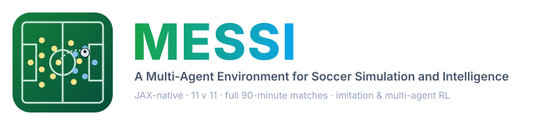
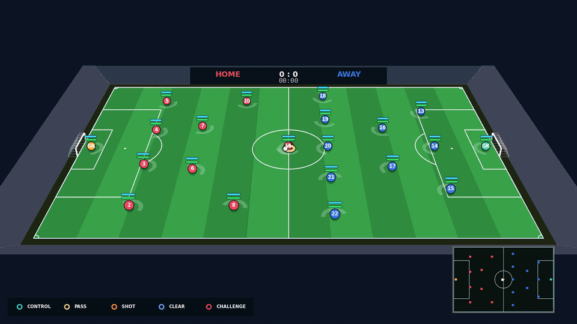

<div align="center">



<h1 aria-label="MESSI: a multi-agent Match Environment for Soccer Simulation and Intelligence">𝓜𝓔𝓢𝓢𝓘: 𝓪 𝓶𝓾𝓵𝓽𝓲-𝓪𝓰𝓮𝓷𝓽 <strong>𝓜</strong>𝓪𝓽𝓬𝓱 <strong>𝓔</strong>𝓷𝓿𝓲𝓻𝓸𝓷𝓶𝓮𝓷𝓽 𝓯𝓸𝓻 <strong>𝓢</strong>𝓸𝓬𝓬𝓮𝓻 <strong>𝓢</strong>𝓲𝓶𝓾𝓵𝓪𝓽𝓲𝓸𝓷 𝓪𝓷𝓭 <strong>𝓘</strong>𝓷𝓽𝓮𝓵𝓵𝓲𝓰𝓮𝓷𝓬𝓮</h1>

<strong>A JAX-native football world engine for player–manager interaction, 3D ball dynamics, causal event data, and multi-agent learning.</strong>

[](LICENSE) [](https://www.python.org/) [](https://github.com/jax-ml/jax) [](#release-status) [](#release-status) [](CITATION.cff)

[Why MESSI](#why-messi) · [Architecture](#architecture) · [Install](#installation) · [Quickstart](#quickstart) · [Contracts](#core-contracts) · [Rendering](#rendering-and-replays) · [Release status](#release-status) · [Documentation](#documentation) · [Citation](#citation)

<a href="docs/assets/rendering/latest-kickoff-10s.mp4">
  
</a>

<sub>MESSI 0.1.0 · seed 3 · <code>salida_lavolpiana</code> vs <code>gegenpress</code>: 80 Hz physics, 10 Hz decisions, and exact 20 fps rendering. Select the animation for the 1080p H.264 clip.</sub>

</div>

---

**MESSI** is a JAX-based football match environment for multi-agent learning,
evaluation, and reproducible simulation. The Python distribution is
`messi-football`; the installed package is imported as `footballworld`.

The environment separates its lean recurrent transition from exact event
telemetry, manager decisions, rendering, and dataset tooling. Ordinary training
therefore carries only the state it needs, while evaluation and replay paths can
retain causal contact, restart, foul, offside, discipline, and management facts.

> [!NOTE]
> MESSI `0.1.0` is a research preview, not a formal stable release. No official
> GitHub Release or PyPI package has been published. It is a research simulator,
> not an official laws-conformance product.

## Why MESSI

Football decisions extend beyond the 22 players on the pitch. Managers change
formation and personnel, registered substitutes constrain those choices, and
both teams adapt to changes in the other. At the same time, real event and
tracking data is expensive and sparse in rare situations. MESSI represents
these decisions in one controllable world so they can be studied without
claiming that simulation replaces observed football.

| Contract | What it makes learnable or auditable |
| --- | --- |
| **Players + managers + benches** | Formation, substitution, discipline, acting-goalkeeper, and opponent-adaptation decisions across a full match |
| **Detailed action + 3D ball** | Independent movement and contact intent, launch, spin, crosses, aerial contests, headers, bounce, and goal-frame interaction |
| **Stateful football rules** | Throw-ins, corners, free kicks, offside, fouls, cards, set-piece takers, and off-ball movement without skipping dead-ball phases |
| **Causal data + policy replacement** | Seeded event/tracking diversity and same-state policy comparisons with explicit simulator-conditional limits |

The differentiator is this combination of contracts, not a claim that every
individual mechanism is unprecedented.

## Architecture

Each card opens the implemented contract it represents.

<p align="center">
  <a href="docs/environment/"></a>
  
  <a href="docs/rollout.md"></a>
  
  <a href="docs/rendering.md#sidecar-schemas-and-lossless-sparse-events"></a>
</p>

Rendering, serialization, validation, and dataset adapters do not enter the
ordinary `env.step` executable. Manager work is applied only at explicit
opening, restart, substitution, or emergency-goalkeeper boundaries.

Training algorithms and provider-data processing are not shipped in this
repository. Those surfaces are planned separately and are not represented as
implemented code in the architecture above.

## Installation

Python 3.10, 3.11, and 3.12 are targeted. During pre-release, install from the
repository so the source revision remains explicit:

```bash
git clone https://github.com/UoS-CIDA-Lab/UOS-FootballMARL-Env.git
cd UOS-FootballMARL-Env
python -m pip install -e .
```

Add the optional rendering stack when producing replays:

```bash
python -m pip install -e '.[render]'
```

> [!IMPORTANT]
> `python -m pip install messi-football` is intentionally not presented as an
> available installation path while the research preview remains unpublished on
> PyPI.

GPU users should follow JAX's platform-specific installation guidance. MESSI
does not select or initialize a JAX backend when `footballworld` is imported.

## Quickstart

The same API used for 11-vs-11 matches can create a small 2-vs-2 smoke test.
Expand the complete, copyable example below.

<details><summary><strong>Run one environment step</strong></summary>

```python
import jax

from footballworld import (
    FootballWorld,
    MatchConfig,
    Player,
    PlayerProfile,
    neutral_action,
)


def player(player_id, x, y, *, goalkeeper=False):
    return Player(
        profile=PlayerProfile(
            player_id=player_id,
            is_goalkeeper=goalkeeper,
        ),
        initial_position=(x, y),
    )


home = (
    player(1, -30.0, -8.0, goalkeeper=True),
    player(2, -10.0, 8.0),
)
away = (
    player(3, -30.0, -8.0, goalkeeper=True),
    player(4, -10.0, 8.0),
)

env = FootballWorld(match=MatchConfig(minimum_team_players=(2, 2)))
reset = env.reset(home, away, key=jax.random.key(0))
action = neutral_action(player_count=4)
result = env.step(reset.rollout, reset.setup, action, jax.random.key(1))

observations = env.observe_all(result.rollout)
```

`env.step` is the compact training transition. Use
`env.step_with_events` only when exact substep telemetry is required for
evaluation, replay, or sampled logging. The two paths share the authoritative
transition and are compiled separately.

</details>

## Core contracts

| Surface | Entry point | Boundary |
| --- | --- | --- |
| Player action and perception | [Action](docs/action-space.md) · [Observation](docs/environment/observation.md) · [Model output](docs/model-output.md) | Typed intents, bounded controls, fixed-shape SI/normalized views, and explicit known/visible masks |
| Manager, bench, and roster | [Manager commands](docs/manager-command.md) · [Roster sampling](docs/roster-sampling.md) | Private bench resources and low-frequency formation, substitution, goalkeeper, and set-piece transactions |
| Rollout and compilation | [Rollout contract](docs/rollout.md) | Separate minimum-memory, training, exact-event, and managed graphs; callers own batching and `jax.jit` |
| Replay outputs | [Rendering](docs/rendering.md) | Host-side video plus lossless numeric tracking and exact causal event sidecars |

Shipped rule-based player and manager policies are seeded reference surfaces,
not measured models of football. Their coefficients remain classified by
provenance in the calibration and reproducibility records.

FootballWorld deliberately keeps one-on-one carrying difficult: a single
carrier is not expected to dribble through a third of the pitch as a routine
escape. The reference policy responds to pressure through support angles,
planned receivers, controlled first touches, contextual quick relays, and
switches of play. This policy improvement does not relax the environment's
contact, tackle, or physical carry gates.

## Rendering and replays

The managed replay pipeline streams fixed exact-event chunks, writes lossless
numeric tracking data to `tracking.npz`, writes exact causal events to
`event.json`, and encodes one host-rendered `match.mp4`.

Run the repository demo with an independently selected rule-policy plan for
each side:

```bash
python demo_match.py --output output/tactical-demo \
  --team-0-plan gegenpress --team-1-plan random --seed 3
```

`--team-0-plan` and `--team-1-plan` accept `salida_lavolpiana`,
`juego_de_posicion`, `gegenpress`, `catenaccio`, `zona_mista`, or `random`;
both default to `juego_de_posicion`. A `random` selection is resolved once per
team from a dedicated key derived from `--seed`, then remains fixed for the
match. Replay provenance records the resolved plans and the rule-policy
configuration fingerprint.

```bash
JAX_PLATFORMS=cpu PYTHONPATH=src python examples/render_full_match.py \
  --seed 3 \
  --output output/kickoff-review \
  --maximum-steps 100 \
  --workers 4 \
  --video-fps 20 \
  --event-chunk 256 \
  --render-chunk 225
```

This command creates a bounded, non-authoritative review capture. Remove
`--maximum-steps` for an environment-terminated regulation match. Release
mode automatically enables a complete pre-publication video decode. Release
captures require a clean, stable Git source and must pass the publication
checks; `--allow-dirty` is reserved for explicit diagnostics.

Generate a verified JSON analysis and a self-contained HTML report from that capture:

```bash
PYTHONPATH=src python -m footballworld.analysis output/kickoff-review \
  --allow-diagnostic
```

See the [rendering and replay contract](docs/rendering.md) and the
[match report pipeline](docs/match-report.md).

## Release status

| Surface | Current state |
| --- | --- |
| Current version | `0.1.0` |
| Source | Research preview; stable release branch not frozen |
| GitHub tag and Release | Not published |
| PyPI package | Not published |
| CI | Pending a green run on the final frozen commit |
| Canonical performance numbers | Pending remeasurement on that same commit |

A future formal release exists only when the default branch, annotated tag,
GitHub Release, built wheel/sdist, PyPI package, and published receipts all
identify the same validated source commit. See the
[release contract](docs/deployment.md#release-contract-gate).

Release gates cover Python 3.10–3.12 import and package construction, focused
semantic checks, an unbudgeted regulation match without exhausted event
capacity, replay decode and sidecar integrity, and revision-specific
CPU/GPU/runtime receipts are retained in the private validation workspace and
are not distributed as current release claims.

Randomness is addressed by explicit match, frame, team, player, and event keys.
Passing software and replay-integrity gates does not by itself establish
empirical football realism; dataset-specific claims retain their own estimand,
split, translation procedure, and held-out evidence.

## Documentation

Public contracts are being organized to mirror their implementation owners:

| Area | Entry point |
| --- | --- |
| Environment and observation | [`docs/environment/`](docs/environment/) |
| Rollout and compilation | [`docs/rollout.md`](docs/rollout.md) |
| Deployment profiles | [`docs/deployment.md`](docs/deployment.md) |
| Rendering and replay | [`docs/rendering.md`](docs/rendering.md) |
| Management | [`docs/manager-command.md`](docs/manager-command.md) |
| Reproducibility | [`docs/reproducibility/`](docs/reproducibility/) |
| Synthetic full-match renderer | [`examples/`](examples/README.md) |

The [documentation map](docs/README.md) defines the package-aligned hierarchy
and records migration status without duplicating normative contracts.

## Contributing

Issues and pull requests are welcome through the
[GitHub repository](https://github.com/UoS-CIDA-Lab/UOS-FootballMARL-Env). Reproducible defect
reports should include the MESSI and JAX versions, backend, immutable
configuration, roster shape, and a seed when one is available.

See [CONTRIBUTING.md](CONTRIBUTING.md) and [SECURITY.md](SECURITY.md).

## Citation

For the `0.1.0` research preview, cite the exact Git commit used by the
experiment together with the machine-readable [CITATION.cff](CITATION.cff).

```bibtex
@software{park_messi_software_2026,
  author    = {Park, Hyunwoo},
  title     = {{MESSI}: A Multi-agent Match Environment for Soccer Simulation and Intelligence},
  year      = {2026},
  license   = {Apache-2.0},
  url       = {https://github.com/UoS-CIDA-Lab/UOS-FootballMARL-Env},
  publisher = {CIDA Lab, University of Seoul},
  note      = {Pre-release source; cite the exact Git commit used}
}
```

## Maintainer

**Hyunwoo Park** — CIDA Lab, University of Seoul.

## Acknowledgments

Special thanks to Hyeokje Cho for contributing to the selection of the project
name **MESSI**, to MIRU HONG for advice on implementing football rules, and to
Professor Sang-Ki Ko for academic supervision and for serving as the project's
academic point of contact.

## License and attribution

Licensed under the [Apache License 2.0](LICENSE). Copyright © 2026 Hyunwoo
Park. Developed at CIDA Lab, University of Seoul. See [NOTICE](NOTICE) for
attribution and [CITATION.cff](CITATION.cff) for citation metadata.
